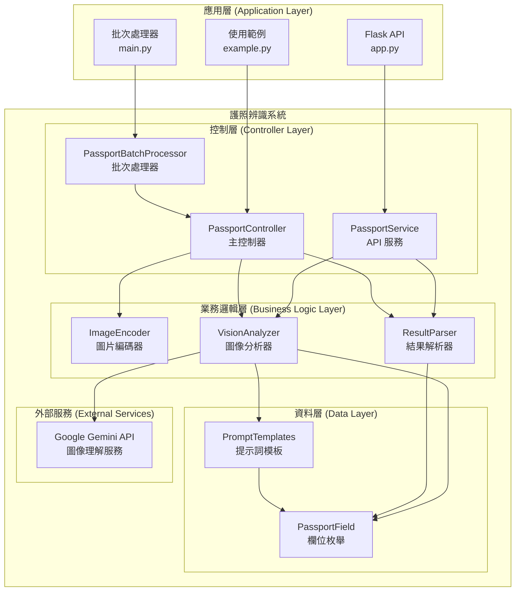
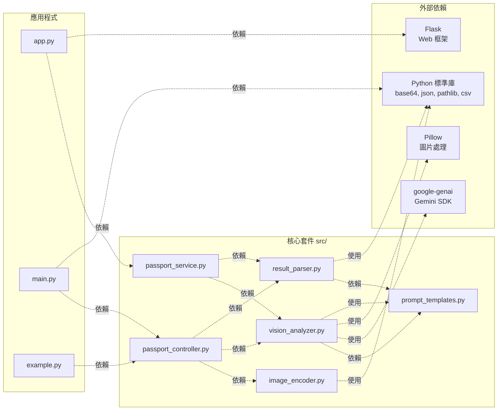
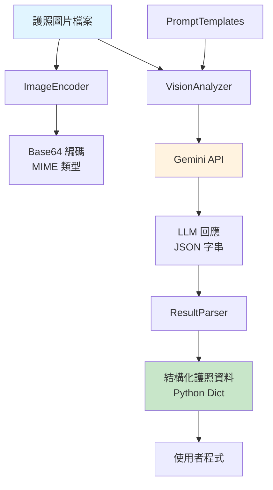
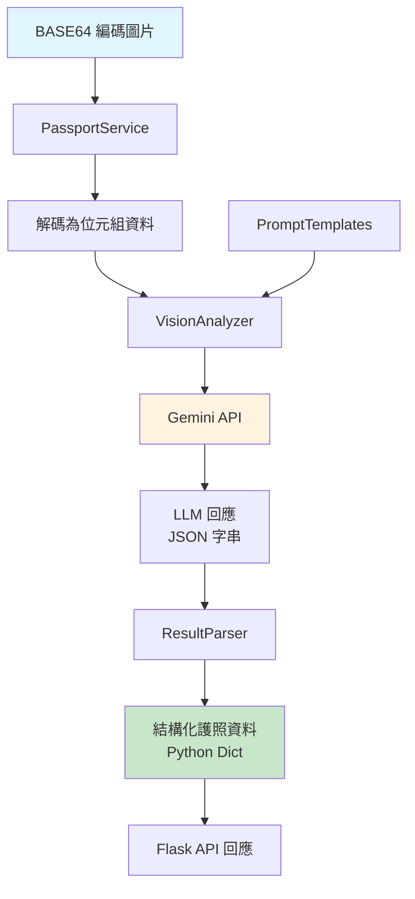
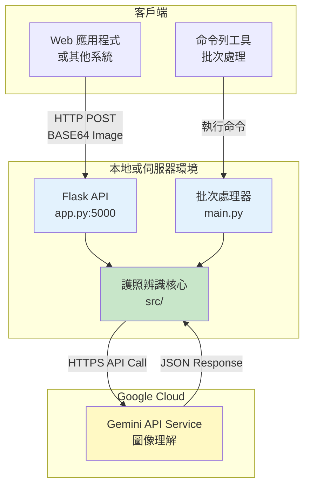

# 護照辨識系統 - 元件圖

本文件展示護照辨識系統的元件結構與依賴關係。

## 系統元件圖

## 依賴關係圖

## 資料流向圖

### 從檔案路徑辨識（PassportController）

### 從 BASE64 辨識（PassportService）

## 元件說明

### 應用層
- **app.py**: Flask API 應用程式，提供 HTTP 介面供外部系統呼叫護照辨識服務
- **main.py**: 批次處理應用程式，可批次處理目錄下的所有護照圖片並輸出 CSV
- **example.py**: 使用範例程式，展示如何使用護照辨識系統

### 控制層
- **PassportController**: 主控制器，協調所有模組的交互作用，支援從本地檔案進行辨識
- **PassportService**: API 服務層，專門處理 BASE64 編碼圖片的辨識，適用於 Web API
- **PassportBatchProcessor**: 批次處理器，負責掃描目錄、批次辨識和 CSV 輸出

### 業務邏輯層
- **ImageEncoder**: 負責圖片編碼和格式驗證
- **VisionAnalyzer**: 負責呼叫 Gemini API 進行圖像理解，支援檔案和位元組資料
- **ResultParser**: 負責解析和結構化 LLM 的回應

### 資料層
- **PromptTemplates**: 管理所有提示詞模板
- **PassportField**: 定義護照欄位的枚舉類型

### 外部服務
- **Google Gemini API**: 提供圖像理解和文字辨識功能

## 部署架構

