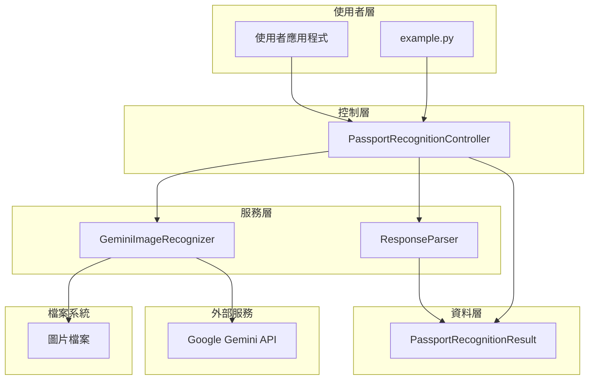
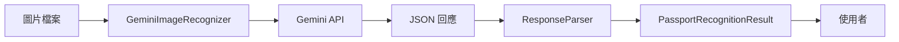
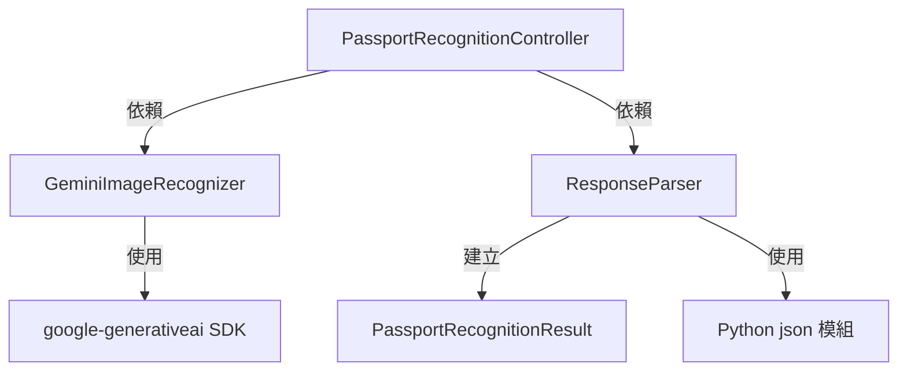

# 護照辨識系統 - 元件圖

本文件展示護照辨識系統的元件架構與依賴關係。

## 系統元件架構

## 元件說明

### 使用者層
- **使用者應用程式**: 呼叫護照辨識系統的外部應用程式
- **example.py**: 系統使用範例程式

### 控制層
- **PassportRecognitionController**: 協調辨識流程的控制器，負責整合各個服務元件

### 服務層
- **GeminiImageRecognizer**: 影像辨識服務，負責與 Gemini API 互動
- **ResponseParser**: 回應解析服務，負責解析 LLM 回傳的結果

### 資料層
- **PassportRecognitionResult**: 封裝辨識結果的資料物件

### 外部服務
- **Google Gemini API**: 提供影像辨識能力的外部 API 服務

### 檔案系統
- **圖片檔案**: 需要辨識的護照圖片檔案

## 資料流向

## 依賴關係

