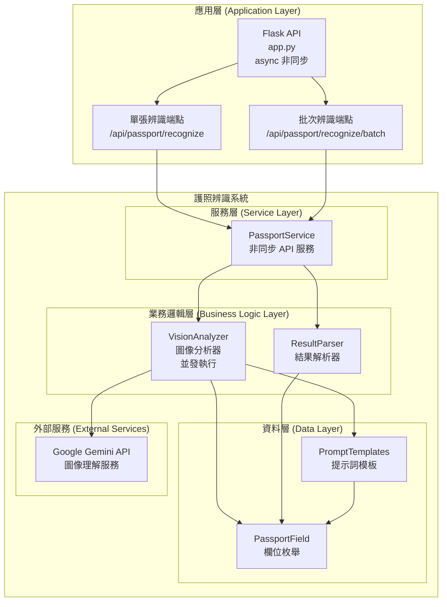
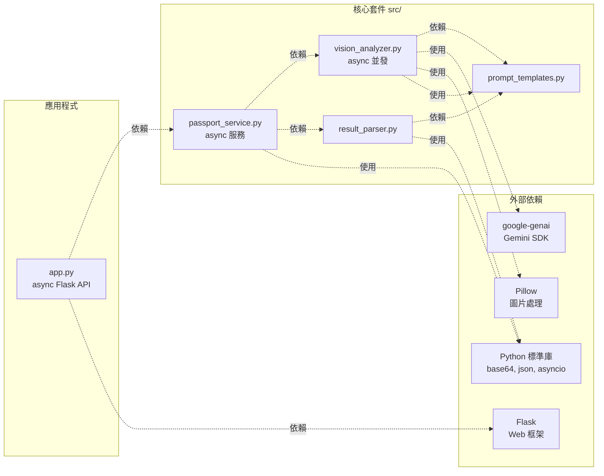
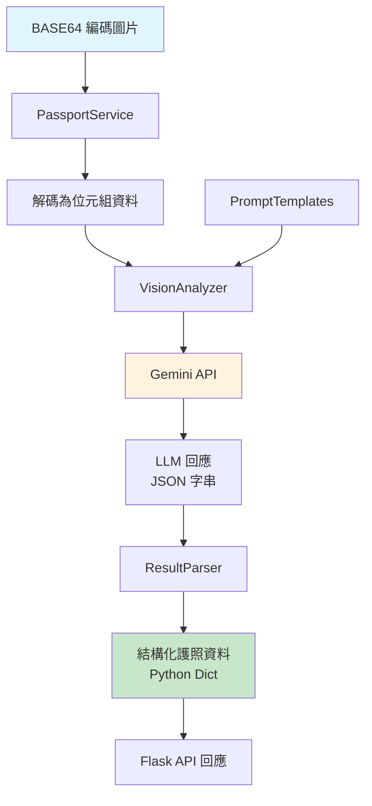
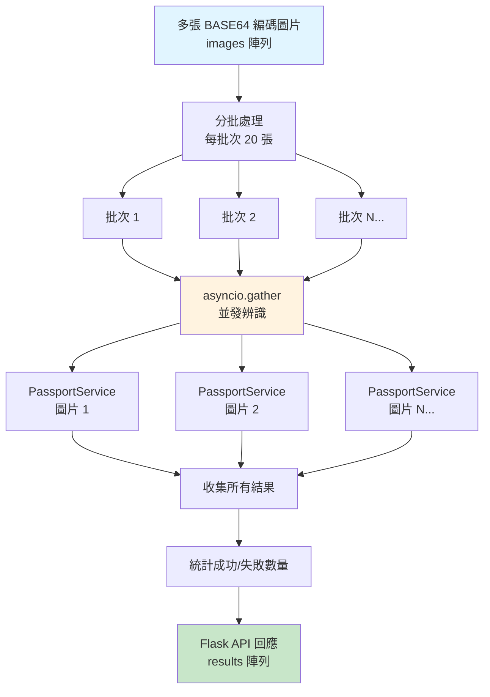
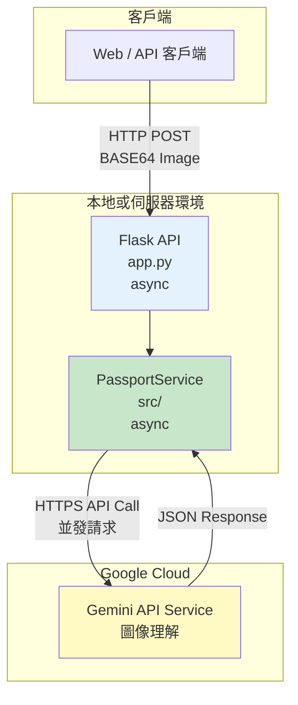

# 護照辨識系統 - 元件圖

本文件展示護照辨識系統的元件結構與依賴關係。

## 系統元件圖

## 依賴關係圖

## 資料流向圖

### 單張辨識流程（/api/passport/recognize）

### 批次辨識流程（/api/passport/recognize/batch）

## 元件說明

### 應用層
- **app.py**: Flask API 應用程式，提供非同步 HTTP 介面供外部系統呼叫護照辨識服務

### 服務層
- **PassportService**: 非同步 API 服務層，專門處理 BASE64 編碼圖片的辨識，使用 async/await 模式提升執行效率

### 業務邏輯層
- **VisionAnalyzer**: 負責呼叫 Gemini API 進行圖像理解，處理圖片位元組資料，使用 `asyncio.gather()` 並發執行所有欄位的分析
- **ResultParser**: 負責解析和結構化 LLM 的回應

### 資料層
- **PromptTemplates**: 管理所有提示詞模板
- **PassportField**: 定義護照欄位的枚舉類型

### 外部服務
- **Google Gemini API**: 提供圖像理解和文字辨識功能

## 部署架構

