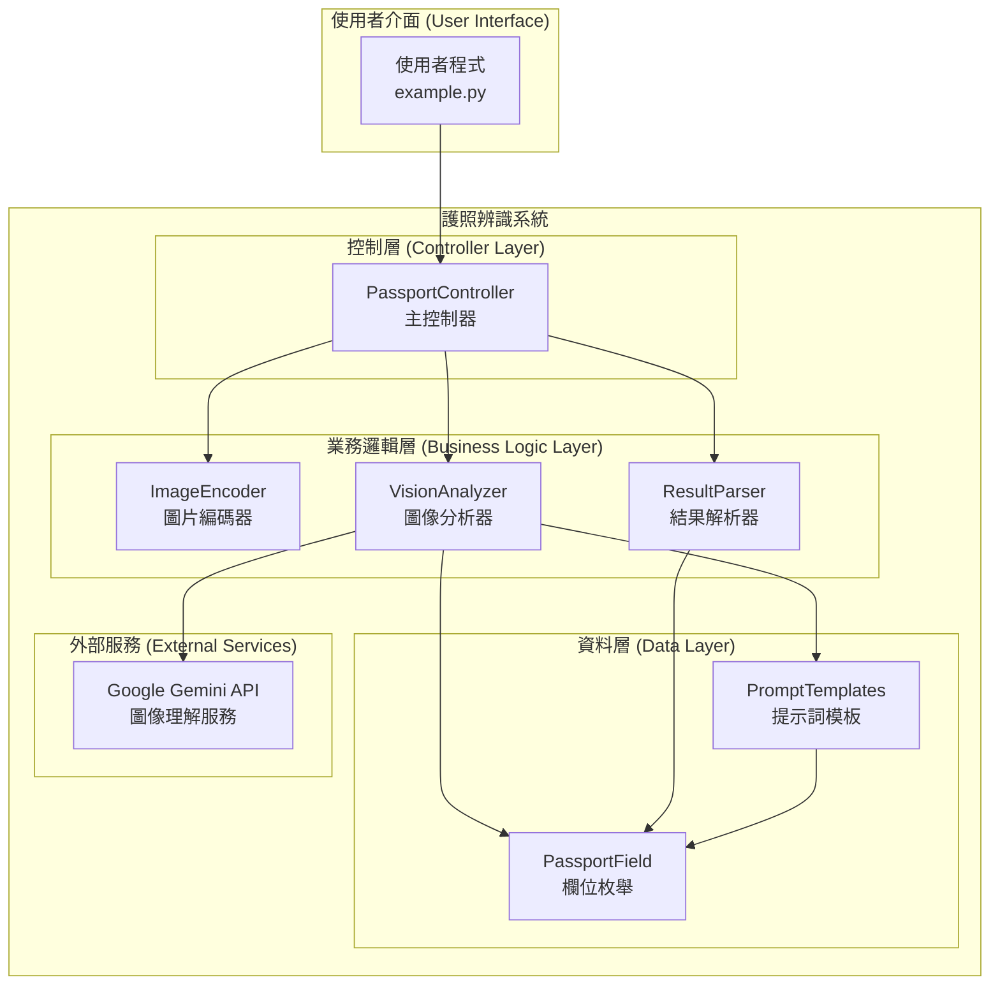
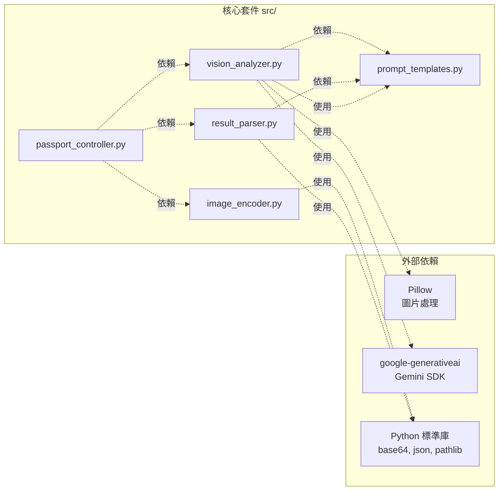
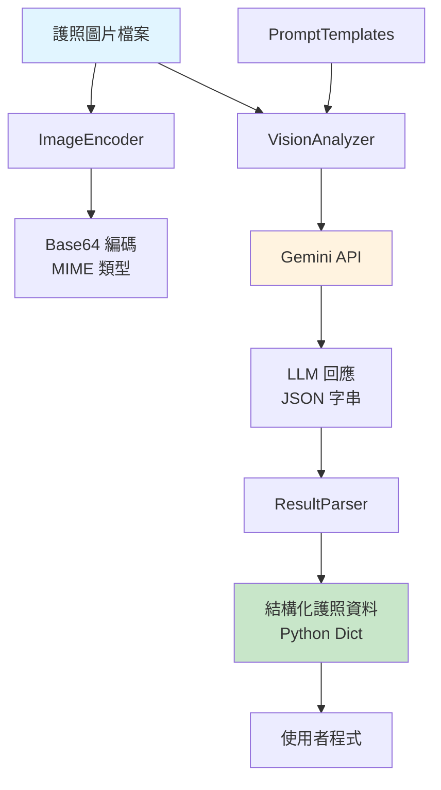
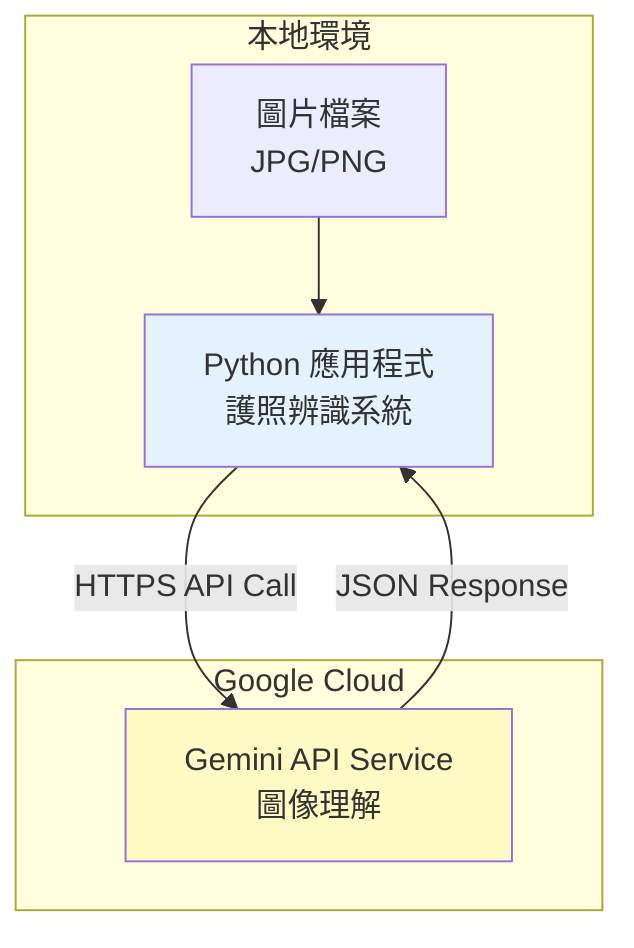

# 護照辨識系統 - 元件圖

本文件展示護照辨識系統的元件結構與依賴關係。

## 系統元件圖

## 依賴關係圖

## 資料流向圖

## 元件說明

### 控制層
- **PassportController**: 主控制器，協調所有模組的交互作用

### 業務邏輯層
- **ImageEncoder**: 負責圖片編碼和格式驗證
- **VisionAnalyzer**: 負責呼叫 Gemini API 進行圖像理解
- **ResultParser**: 負責解析和結構化 LLM 的回應

### 資料層
- **PromptTemplates**: 管理所有提示詞模板
- **PassportField**: 定義護照欄位的枚舉類型

### 外部服務
- **Google Gemini API**: 提供圖像理解和文字辨識功能

## 部署架構

