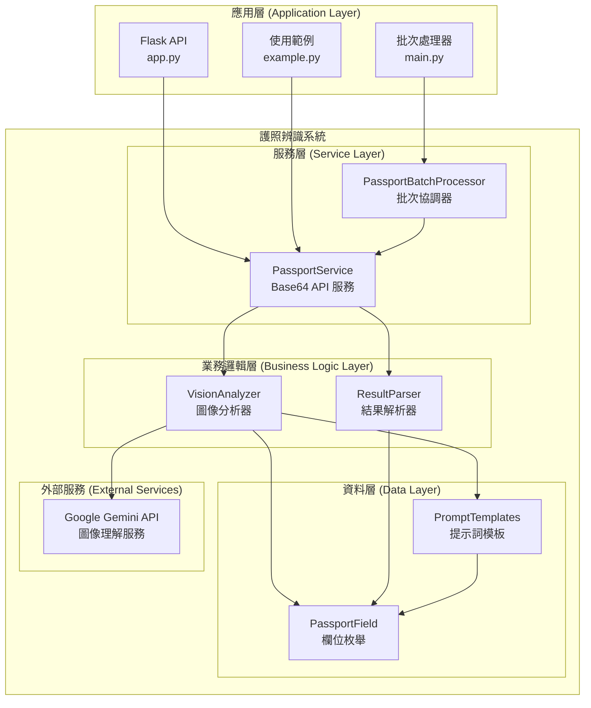
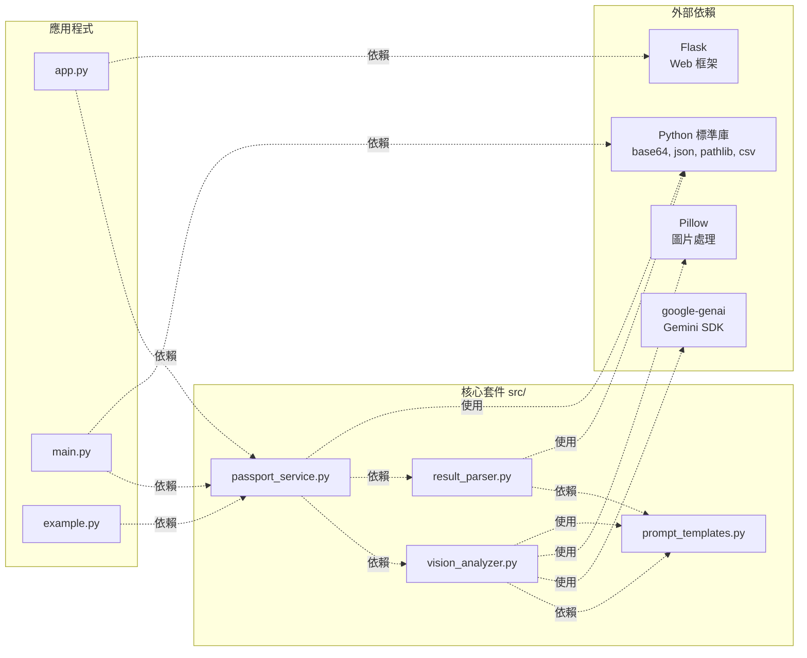
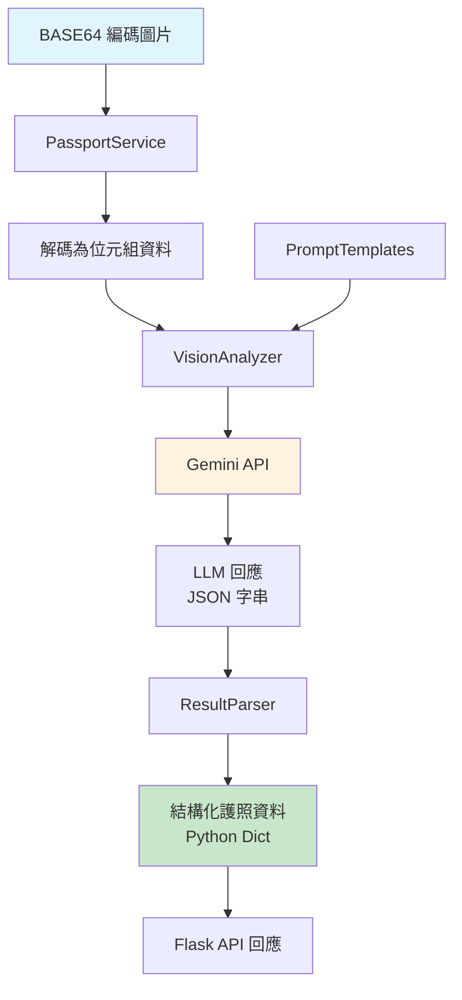
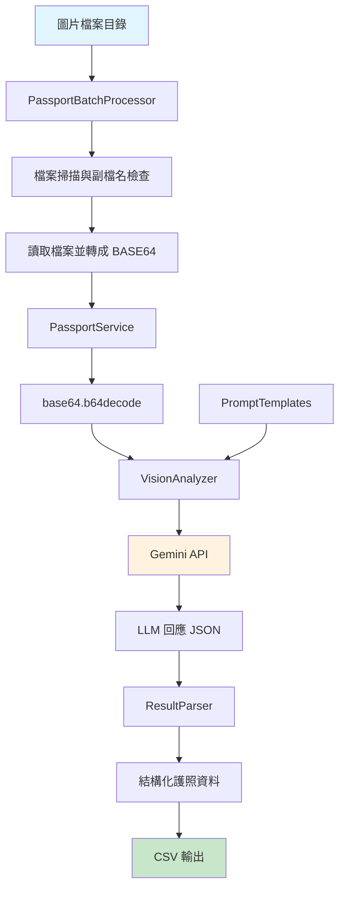
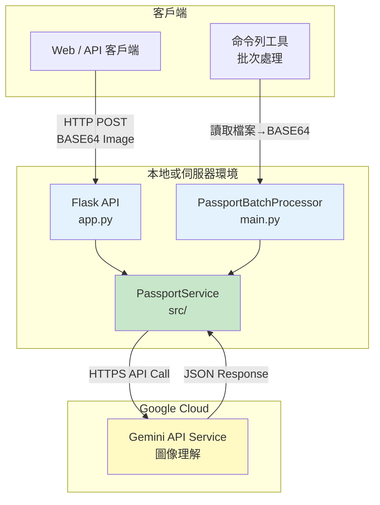

# 護照辨識系統 - 元件圖

本文件展示護照辨識系統的元件結構與依賴關係。

## 系統元件圖

## 依賴關係圖

## 資料流向圖

### API / BASE64 即時辨識（PassportService）

### 批次處理（PassportBatchProcessor）

## 元件說明

### 應用層
- **app.py**: Flask API 應用程式，提供 HTTP 介面供外部系統呼叫護照辨識服務
- **main.py**: 批次處理應用程式，將圖片轉為 BASE64 後呼叫服務並輸出 CSV
- **example.py**: 使用範例程式，展示如何將檔案轉為 BASE64 並呼叫服務

### 服務層
- **PassportService**: API 服務層，專門處理 BASE64 編碼圖片的辨識，適用於 Web API 與批次情境
- **PassportBatchProcessor**: 批次處理器，負責掃描目錄、轉換 BASE64、呼叫服務並輸出 CSV

### 業務邏輯層
- **VisionAnalyzer**: 負責呼叫 Gemini API 進行圖像理解，處理圖片位元組資料
- **ResultParser**: 負責解析和結構化 LLM 的回應

### 資料層
- **PromptTemplates**: 管理所有提示詞模板
- **PassportField**: 定義護照欄位的枚舉類型

### 外部服務
- **Google Gemini API**: 提供圖像理解和文字辨識功能

## 部署架構

