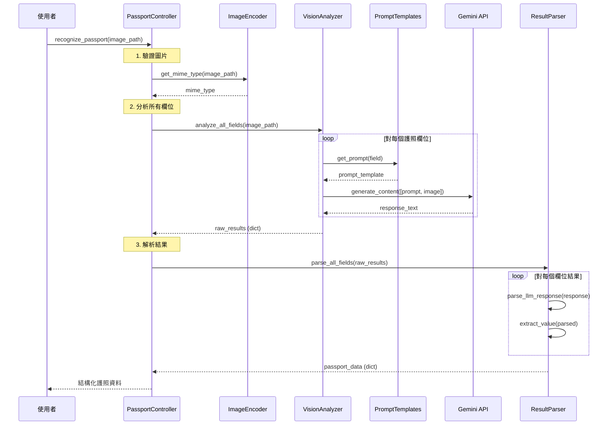
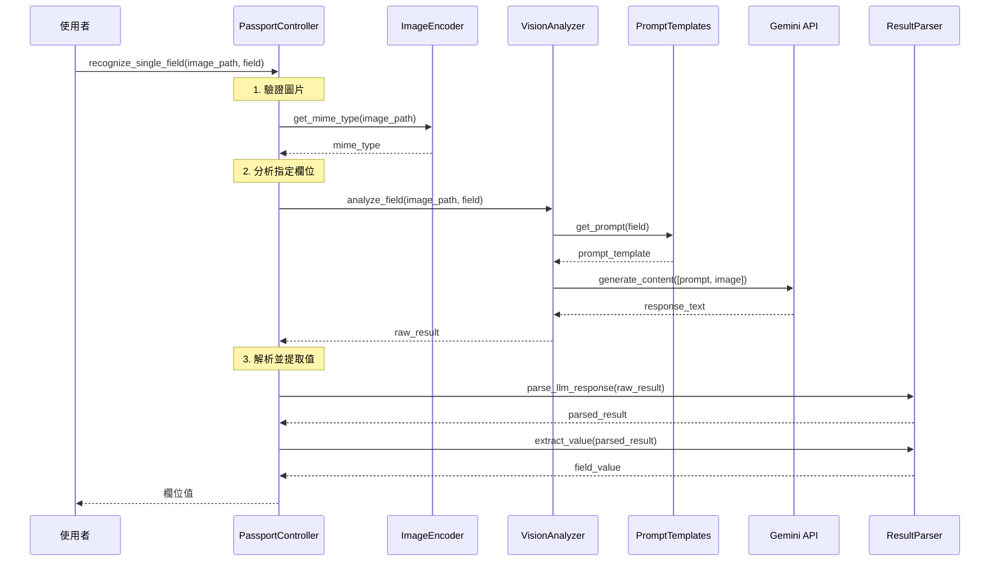
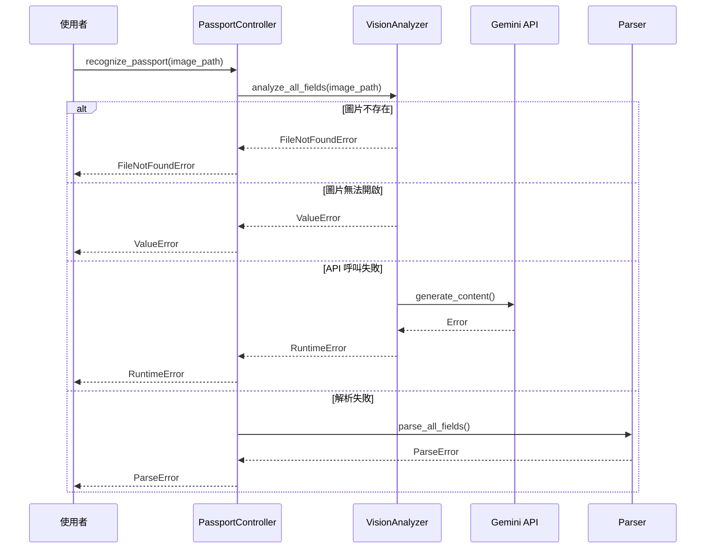

# 護照辨識系統 - 序列圖

本文件展示護照辨識系統的執行流程與物件互動。

## 完整護照辨識流程

```mermaid
sequenceDiagram
    participant User as 使用者
    participant Controller as PassportController
    participant Encoder as ImageEncoder
    participant Analyzer as VisionAnalyzer
    participant Templates as PromptTemplates
    participant API as Gemini API
    participant Parser as ResultParser
    
    User->>Controller: recognize_passport(image_path)
    
    Note over Controller: 1. 驗證圖片
    Controller->>Encoder: get_mime_type(image_path)
    Encoder-->>Controller: mime_type
    
    Note over Controller: 2. 分析所有欄位
    Controller->>Analyzer: analyze_all_fields(image_path)
    
    loop 對每個護照欄位
        Analyzer->>Templates: get_prompt(field)
        Templates-->>Analyzer: prompt_template
        Analyzer->>API: generate_content([prompt, image])
        API-->>Analyzer: response_text
    end
    
    Analyzer-->>Controller: raw_results (dict)
    
    Note over Controller: 3. 解析結果
    Controller->>Parser: parse_all_fields(raw_results)
    
    loop 對每個欄位結果
        Parser->>Parser: parse_llm_response(response)
        Parser->>Parser: extract_value(parsed)
    end
    
    Parser-->>Controller: passport_data (dict)
    Controller-->>User: 結構化護照資料
```

## 單一欄位辨識流程

```mermaid
sequenceDiagram
    participant User as 使用者
    participant Controller as PassportController
    participant Encoder as ImageEncoder
    participant Analyzer as VisionAnalyzer
    participant Templates as PromptTemplates
    participant API as Gemini API
    participant Parser as ResultParser
    
    User->>Controller: recognize_single_field(image_path, field)
    
    Note over Controller: 1. 驗證圖片
    Controller->>Encoder: get_mime_type(image_path)
    Encoder-->>Controller: mime_type
    
    Note over Controller: 2. 分析指定欄位
    Controller->>Analyzer: analyze_field(image_path, field)
    Analyzer->>Templates: get_prompt(field)
    Templates-->>Analyzer: prompt_template
    Analyzer->>API: generate_content([prompt, image])
    API-->>Analyzer: response_text
    Analyzer-->>Controller: raw_result
    
    Note over Controller: 3. 解析並提取值
    Controller->>Parser: parse_llm_response(raw_result)
    Parser-->>Controller: parsed_result
    Controller->>Parser: extract_value(parsed_result)
    Parser-->>Controller: field_value
    
    Controller-->>User: 欄位值
```

## 錯誤處理流程

```mermaid
sequenceDiagram
    participant User as 使用者
    participant Controller as PassportController
    participant Analyzer as VisionAnalyzer
    participant API as Gemini API
    
    User->>Controller: recognize_passport(image_path)
    Controller->>Analyzer: analyze_all_fields(image_path)
    
    alt 圖片不存在
        Analyzer-->>Controller: FileNotFoundError
        Controller-->>User: FileNotFoundError
    else 圖片無法開啟
        Analyzer-->>Controller: ValueError
        Controller-->>User: ValueError
    else API 呼叫失敗
        Analyzer->>API: generate_content()
        API-->>Analyzer: Error
        Analyzer-->>Controller: RuntimeError
        Controller-->>User: RuntimeError
    else 解析失敗
        Controller->>Parser: parse_all_fields()
        Parser-->>Controller: ParseError
        Controller-->>User: ParseError
    end
```
