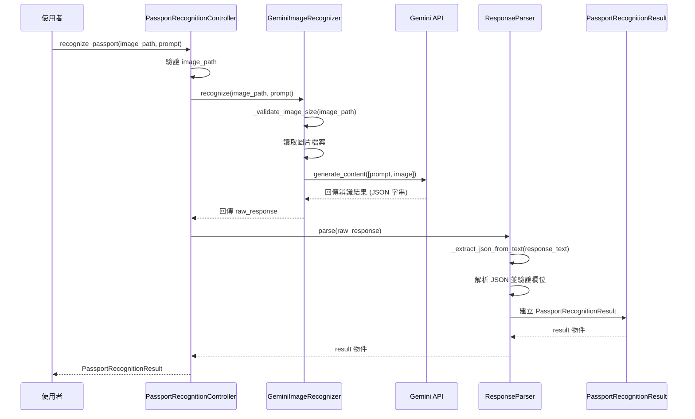
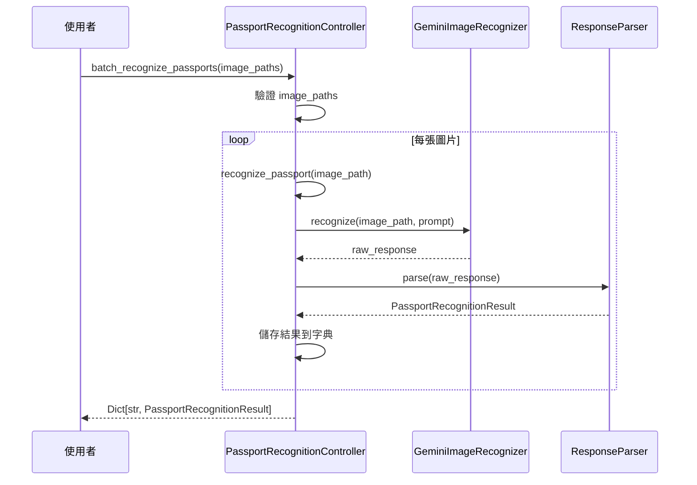
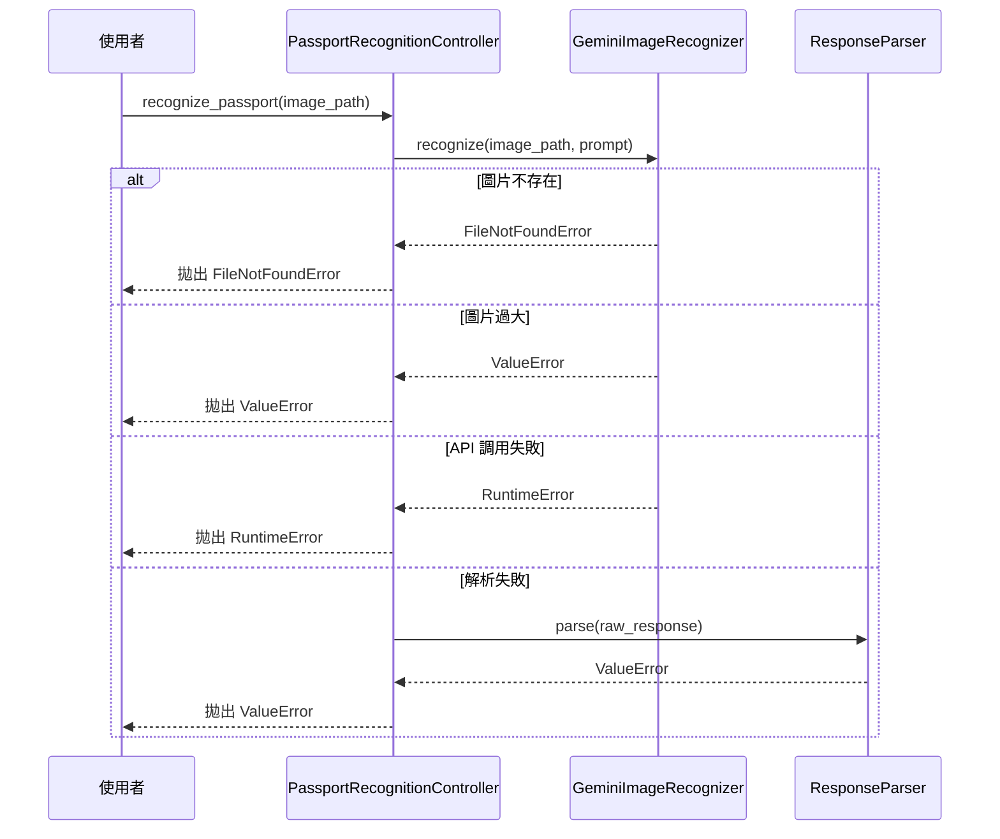

# 護照辨識系統 - 序列圖

本文件展示護照辨識系統的執行流程與互動序列。

## 單張圖片辨識流程

```mermaid
sequenceDiagram
    participant User as 使用者
    participant Controller as PassportRecognitionController
    participant Recognizer as GeminiImageRecognizer
    participant API as Gemini API
    participant Parser as ResponseParser
    participant Result as PassportRecognitionResult

    User->>Controller: recognize_passport(image_path, prompt)
    Controller->>Controller: 驗證 image_path
    Controller->>Recognizer: recognize(image_path, prompt)
    Recognizer->>Recognizer: _validate_image_size(image_path)
    Recognizer->>Recognizer: 讀取圖片檔案
    Recognizer->>API: generate_content([prompt, image])
    API-->>Recognizer: 回傳辨識結果 (JSON 字串)
    Recognizer-->>Controller: 回傳 raw_response
    Controller->>Parser: parse(raw_response)
    Parser->>Parser: _extract_json_from_text(response_text)
    Parser->>Parser: 解析 JSON 並驗證欄位
    Parser->>Result: 建立 PassportRecognitionResult
    Result-->>Parser: result 物件
    Parser-->>Controller: result 物件
    Controller-->>User: PassportRecognitionResult
```

## 批次辨識流程

```mermaid
sequenceDiagram
    participant User as 使用者
    participant Controller as PassportRecognitionController
    participant Recognizer as GeminiImageRecognizer
    participant Parser as ResponseParser

    User->>Controller: batch_recognize_passports(image_paths)
    Controller->>Controller: 驗證 image_paths
    
    loop 每張圖片
        Controller->>Controller: recognize_passport(image_path)
        Controller->>Recognizer: recognize(image_path, prompt)
        Recognizer-->>Controller: raw_response
        Controller->>Parser: parse(raw_response)
        Parser-->>Controller: PassportRecognitionResult
        Controller->>Controller: 儲存結果到字典
    end
    
    Controller-->>User: Dict[str, PassportRecognitionResult]
```

## 錯誤處理流程

```mermaid
sequenceDiagram
    participant User as 使用者
    participant Controller as PassportRecognitionController
    participant Recognizer as GeminiImageRecognizer
    participant Parser as ResponseParser

    User->>Controller: recognize_passport(image_path)
    Controller->>Recognizer: recognize(image_path, prompt)
    
    alt 圖片不存在
        Recognizer-->>Controller: FileNotFoundError
        Controller-->>User: 拋出 FileNotFoundError
    else 圖片過大
        Recognizer-->>Controller: ValueError
        Controller-->>User: 拋出 ValueError
    else API 調用失敗
        Recognizer-->>Controller: RuntimeError
        Controller-->>User: 拋出 RuntimeError
    else 解析失敗
        Controller->>Parser: parse(raw_response)
        Parser-->>Controller: ValueError
        Controller-->>User: 拋出 ValueError
    end
```
