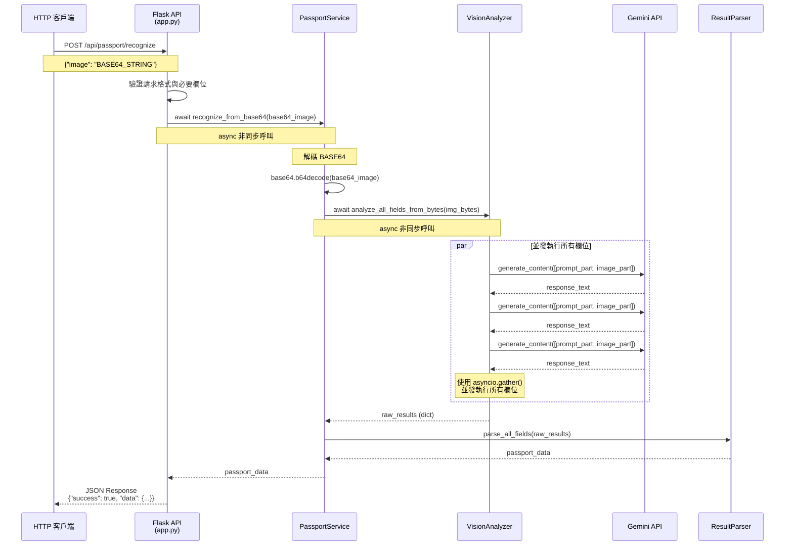
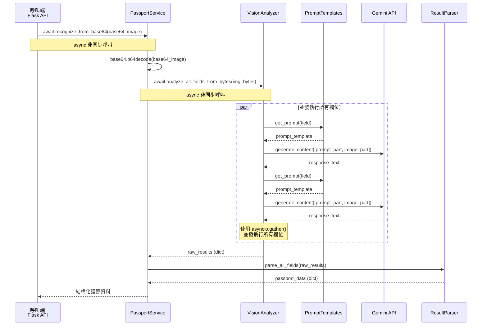
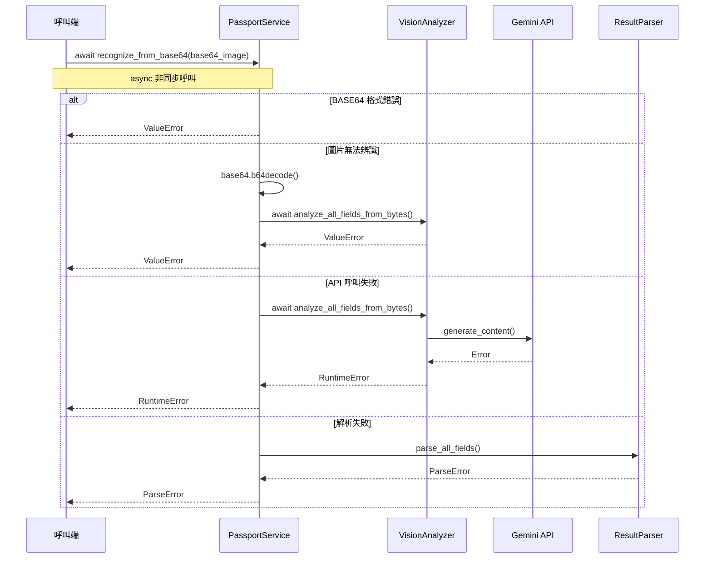

# 護照辨識系統 - 序列圖

本文件展示護照辨識系統的執行流程與物件互動。

## Flask API 護照辨識流程

```mermaid
sequenceDiagram
    participant Client as HTTP 客戶端
    participant API as Flask API<br/>(app.py)
    participant Service as PassportService
    participant Analyzer as VisionAnalyzer
    participant GAPI as Gemini API
    participant Parser as ResultParser
    
    Client->>API: POST /api/passport/recognize
    Note over Client,API: {"image": "BASE64_STRING"}
    
    API->>API: 驗證請求格式與必要欄位
    
    API->>Service: await recognize_from_base64(base64_image)
    Note over API,Service: async 非同步呼叫
    
    Note over Service: 解碼 BASE64
    Service->>Service: base64.b64decode(base64_image)
    
    Service->>Analyzer: await analyze_all_fields_from_bytes(img_bytes)
    Note over Service,Analyzer: async 非同步呼叫
    
    par 並發執行所有欄位
        Analyzer->>GAPI: generate_content([prompt_part, image_part])
        GAPI-->>Analyzer: response_text
        Analyzer->>GAPI: generate_content([prompt_part, image_part])
        GAPI-->>Analyzer: response_text
        Analyzer->>GAPI: generate_content([prompt_part, image_part])
        GAPI-->>Analyzer: response_text
        Note over Analyzer: 使用 asyncio.gather()<br/>並發執行所有欄位
    end
    
    Analyzer-->>Service: raw_results (dict)
    
    Service->>Parser: parse_all_fields(raw_results)
    Parser-->>Service: passport_data
    
    Service-->>API: passport_data
    
    API-->>Client: JSON Response<br/>{"success": true, "data": {...}}
```

## 完整護照辨識流程

```mermaid
sequenceDiagram
    participant Caller as 呼叫端<br/>Flask API
    participant Service as PassportService
    participant Analyzer as VisionAnalyzer
    participant Templates as PromptTemplates
    participant API as Gemini API
    participant Parser as ResultParser
    
    Caller->>Service: await recognize_from_base64(base64_image)
    Note over Caller,Service: async 非同步呼叫
    
    Service->>Service: base64.b64decode(base64_image)
    Service->>Analyzer: await analyze_all_fields_from_bytes(img_bytes)
    Note over Service,Analyzer: async 非同步呼叫
    
    par 並發執行所有欄位
        Analyzer->>Templates: get_prompt(field)
        Templates-->>Analyzer: prompt_template
        Analyzer->>API: generate_content([prompt_part, image_part])
        API-->>Analyzer: response_text
        
        Analyzer->>Templates: get_prompt(field)
        Templates-->>Analyzer: prompt_template
        Analyzer->>API: generate_content([prompt_part, image_part])
        API-->>Analyzer: response_text
        
        Note over Analyzer: 使用 asyncio.gather()<br/>並發執行所有欄位
    end
    
    Analyzer-->>Service: raw_results (dict)
    Service->>Parser: parse_all_fields(raw_results)
    Parser-->>Service: passport_data (dict)
    Service-->>Caller: 結構化護照資料
```

## 錯誤處理流程

```mermaid
sequenceDiagram
    participant Caller as 呼叫端
    participant Service as PassportService
    participant Analyzer as VisionAnalyzer
    participant API as Gemini API
    participant Parser as ResultParser
    
    Caller->>Service: await recognize_from_base64(base64_image)
    Note over Caller,Service: async 非同步呼叫
    
    alt BASE64 格式錯誤
        Service-->>Caller: ValueError
    else 圖片無法辨識
        Service->>Service: base64.b64decode()
        Service->>Analyzer: await analyze_all_fields_from_bytes()
        Analyzer-->>Service: ValueError
        Service-->>Caller: ValueError
    else API 呼叫失敗
        Service->>Analyzer: await analyze_all_fields_from_bytes()
        Analyzer->>API: generate_content()
        API-->>Analyzer: Error
        Analyzer-->>Service: RuntimeError
        Service-->>Caller: RuntimeError
    else 解析失敗
        Service->>Parser: parse_all_fields()
        Parser-->>Service: ParseError
        Service-->>Caller: ParseError
    end
```
