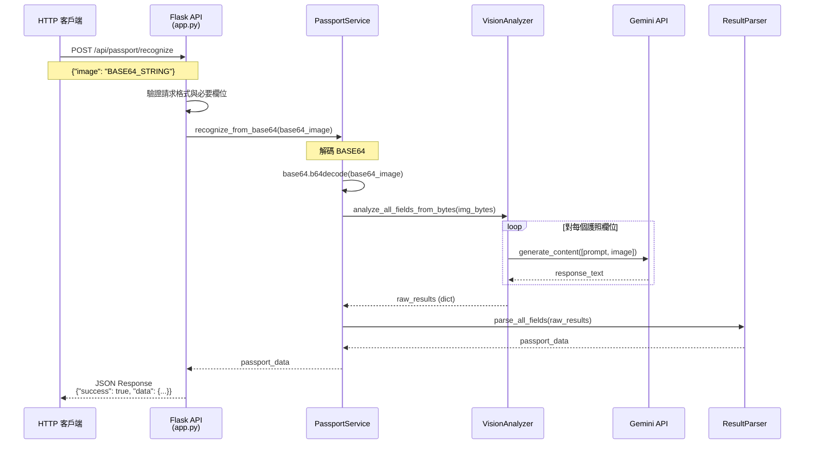
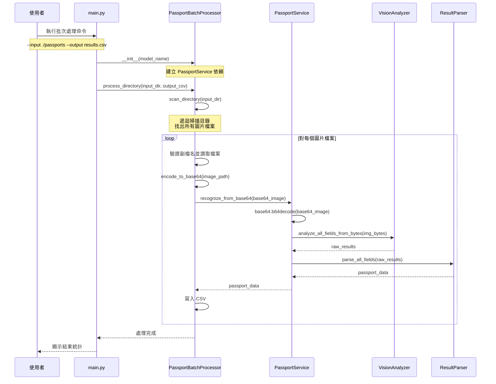
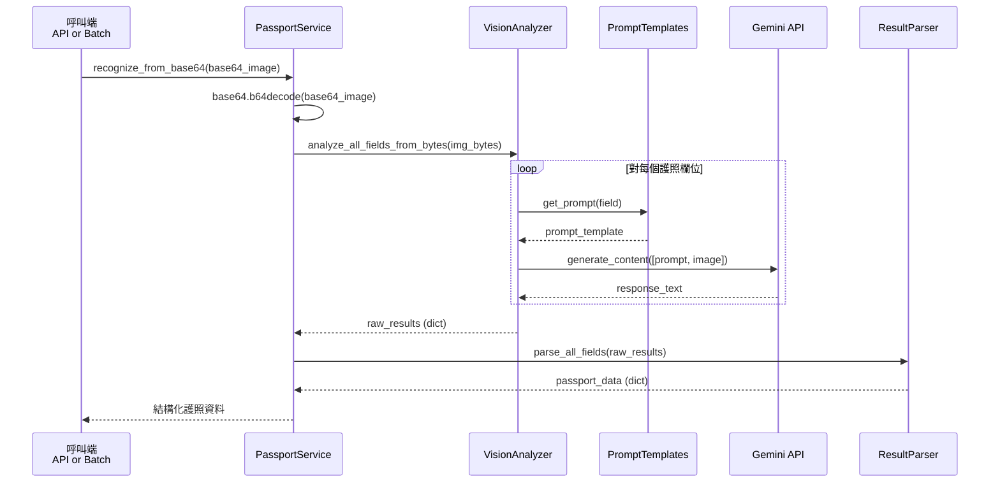
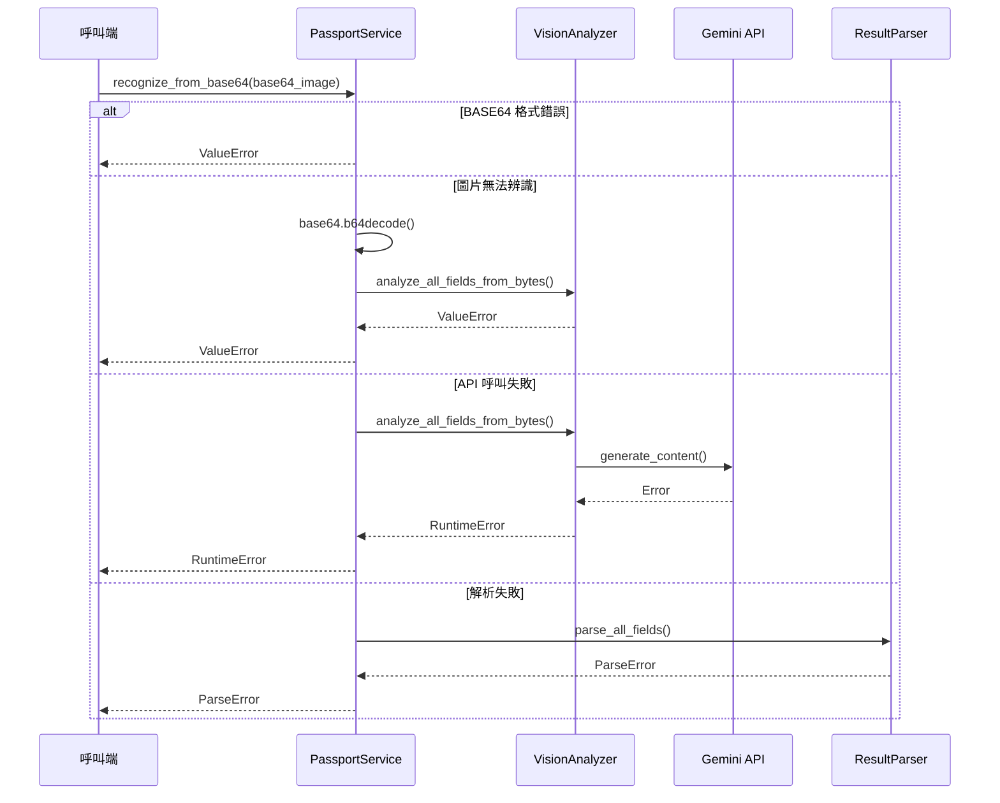

# 護照辨識系統 - 序列圖

本文件展示護照辨識系統的執行流程與物件互動。

## Flask API 護照辨識流程

```mermaid
sequenceDiagram
    participant Client as HTTP 客戶端
    participant API as Flask API<br/>(app.py)
    participant Service as PassportService
    participant Analyzer as VisionAnalyzer
    participant GAPI as Gemini API
    participant Parser as ResultParser
    
    Client->>API: POST /api/passport/recognize
    Note over Client,API: {"image": "BASE64_STRING"}
    
    API->>API: 驗證請求格式與必要欄位
    
    API->>Service: recognize_from_base64(base64_image)
    
    Note over Service: 解碼 BASE64
    Service->>Service: base64.b64decode(base64_image)
    
    Service->>Analyzer: analyze_all_fields_from_bytes(img_bytes)
    
    loop 對每個護照欄位
        Analyzer->>GAPI: generate_content([prompt, image])
        GAPI-->>Analyzer: response_text
    end
    
    Analyzer-->>Service: raw_results (dict)
    
    Service->>Parser: parse_all_fields(raw_results)
    Parser-->>Service: passport_data
    
    Service-->>API: passport_data
    
    API-->>Client: JSON Response<br/>{"success": true, "data": {...}}
```

## 批次處理護照辨識流程

```mermaid
sequenceDiagram
    participant User as 使用者
    participant Main as main.py
    participant Batch as PassportBatchProcessor
    participant Service as PassportService
    participant Analyzer as VisionAnalyzer
    participant Parser as ResultParser
    
    User->>Main: 執行批次處理命令
    Note over User,Main: --input ./passports --output results.csv
    
    Main->>Batch: __init__(model_name)
    Note over Batch: 建立 PassportService 依賴
    
    Main->>Batch: process_directory(input_dir, output_csv)
    Batch->>Batch: scan_directory(input_dir)
    Note over Batch: 遞迴掃描目錄<br/>找出所有圖片檔案
    
    loop 對每個圖片檔案
        Batch->>Batch: 驗證副檔名並讀取檔案
        Batch->>Batch: encode_to_base64(image_path)
        Batch->>Service: recognize_from_base64(base64_image)
        
        Service->>Service: base64.b64decode(base64_image)
        Service->>Analyzer: analyze_all_fields_from_bytes(img_bytes)
        Analyzer-->>Service: raw_results
        
        Service->>Parser: parse_all_fields(raw_results)
        Parser-->>Service: passport_data
        
        Service-->>Batch: passport_data
        Batch->>Batch: 寫入 CSV
    end
    
    Batch-->>Main: 處理完成
    Main-->>User: 顯示結果統計
```

## 完整護照辨識流程

```mermaid
sequenceDiagram
    participant Caller as 呼叫端<br/>API or Batch
    participant Service as PassportService
    participant Analyzer as VisionAnalyzer
    participant Templates as PromptTemplates
    participant API as Gemini API
    participant Parser as ResultParser
    
    Caller->>Service: recognize_from_base64(base64_image)
    Service->>Service: base64.b64decode(base64_image)
    Service->>Analyzer: analyze_all_fields_from_bytes(img_bytes)
    
    loop 對每個護照欄位
        Analyzer->>Templates: get_prompt(field)
        Templates-->>Analyzer: prompt_template
        Analyzer->>API: generate_content([prompt, image])
        API-->>Analyzer: response_text
    end
    
    Analyzer-->>Service: raw_results (dict)
    Service->>Parser: parse_all_fields(raw_results)
    Parser-->>Service: passport_data (dict)
    Service-->>Caller: 結構化護照資料
```

## 錯誤處理流程

```mermaid
sequenceDiagram
    participant Caller as 呼叫端
    participant Service as PassportService
    participant Analyzer as VisionAnalyzer
    participant API as Gemini API
    participant Parser as ResultParser
    
    Caller->>Service: recognize_from_base64(base64_image)
    
    alt BASE64 格式錯誤
        Service-->>Caller: ValueError
    else 圖片無法辨識
        Service->>Service: base64.b64decode()
        Service->>Analyzer: analyze_all_fields_from_bytes()
        Analyzer-->>Service: ValueError
        Service-->>Caller: ValueError
    else API 呼叫失敗
        Service->>Analyzer: analyze_all_fields_from_bytes()
        Analyzer->>API: generate_content()
        API-->>Analyzer: Error
        Analyzer-->>Service: RuntimeError
        Service-->>Caller: RuntimeError
    else 解析失敗
        Service->>Parser: parse_all_fields()
        Parser-->>Service: ParseError
        Service-->>Caller: ParseError
    end
```
