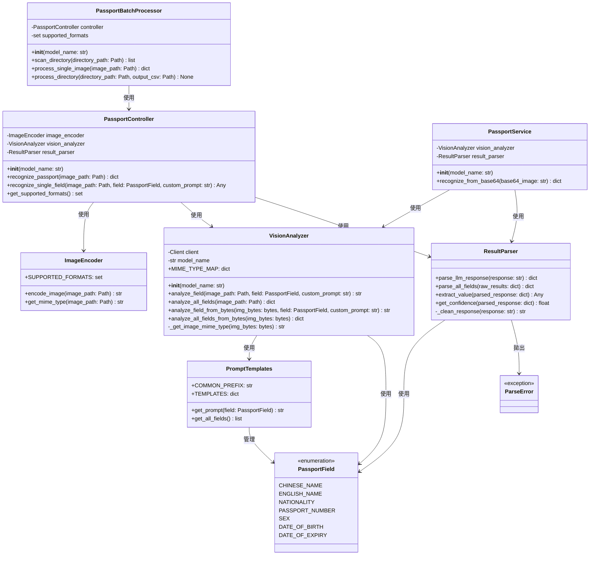

# 護照辨識系統 - 類別圖

本文件展示護照辨識系統的類別結構與關係。

## 類別圖

## 類別說明

### PassportController
主控制器類別，負責協調所有模組的交互，提供完整的護照辨識流程。支援從本地圖片檔案進行護照辨識。

### PassportService
護照辨識服務類別，專門處理從 BASE64 編碼圖片進行辨識的場景，適用於 API 服務。與 PassportController 不同的是，它不依賴 ImageEncoder，直接處理位元組資料。

### PassportBatchProcessor
護照批次處理器類別，負責掃描目錄下的所有圖片檔案，批次進行護照辨識，並將結果輸出為 CSV 檔案。使用 PassportController 進行實際的辨識工作。

### ImageEncoder
圖片編碼器，負責將圖片檔案轉換為 base64 編碼字串和取得 MIME 類型。

### VisionAnalyzer
圖像理解分析器，使用 Google Gemini API 對護照圖片進行文字辨識與理解。支援從檔案路徑或位元組資料進行分析。

### ResultParser
結果解析器，負責將 LLM 返回的 JSON 字串解析成結構化的護照資料。

### PromptTemplates
提示詞模板管理類別，儲存和管理護照辨識各欄位的提示詞模板。

### PassportField
護照欄位枚舉，定義護照中需要辨識的各個欄位類型。

### ParseError
自訂異常類別，用於處理解析過程中發生的錯誤。
