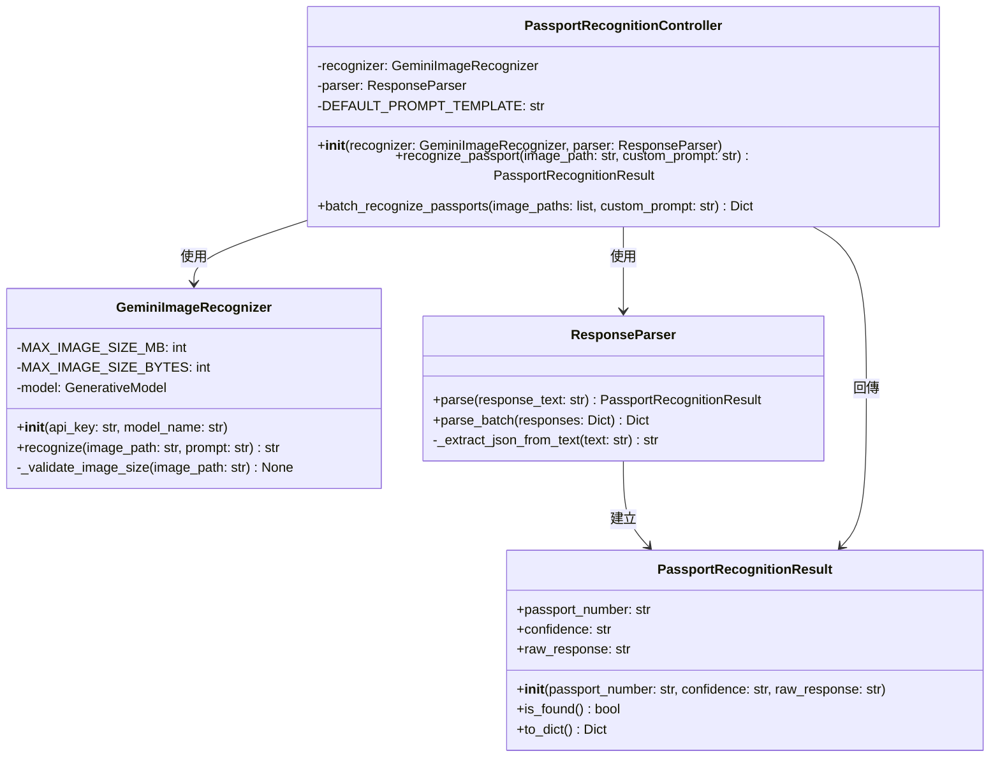

# 護照辨識系統 - 類別圖

本文件展示護照辨識系統的類別結構與關係。

## 系統類別圖

## 類別說明

### GeminiImageRecognizer
負責與 Google Gemini API 互動，處理圖片讀取、驗證和辨識功能。

### PassportRecognitionController
控制器類別，協調整個辨識流程，管理辨識器和解析器的互動。

### ResponseParser
解析 LLM 回傳的文字內容，將 JSON 格式字串轉換為結構化的結果物件。

### PassportRecognitionResult
封裝護照辨識結果的資料類別，提供結果查詢和轉換功能。
