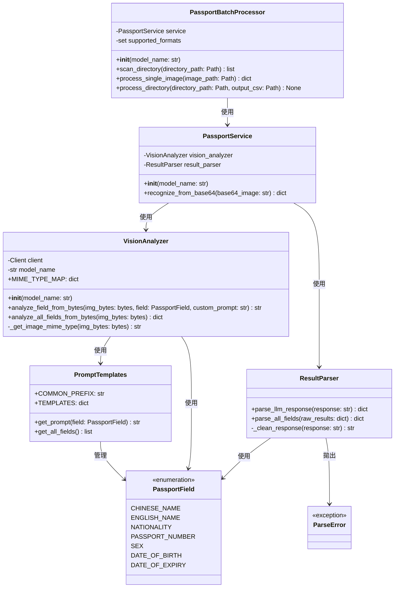

# 護照辨識系統 - 類別圖

本文件展示護照辨識系統的類別結構與關係。

## 類別圖

## 類別說明

### PassportService
護照辨識服務類別，專門處理從 BASE64 編碼圖片進行辨識的場景。負責解碼、呼叫 VisionAnalyzer 完成欄位分析，並交由 ResultParser 進行結構化解析。

### PassportBatchProcessor
護照批次處理器類別，負責掃描目錄下的所有圖片檔案，將檔案轉為 BASE64 並呼叫 PassportService，最終將結果輸出為 CSV 檔案。

### VisionAnalyzer
圖像理解分析器，使用 Google Gemini API 對護照圖片進行文字辨識與理解。接收圖片位元組資料，對各欄位逐一發出提示詞並收集回應。

### ResultParser
結果解析器，負責將 LLM 返回的 JSON 字串解析成結構化的護照資料。

### PromptTemplates
提示詞模板管理類別，儲存和管理護照辨識各欄位的提示詞模板。

### PassportField
護照欄位枚舉，定義護照中需要辨識的各個欄位類型。

### ParseError
自訂異常類別，用於處理解析過程中發生的錯誤。
